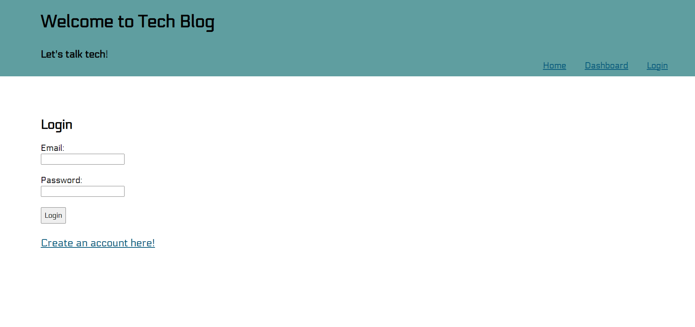
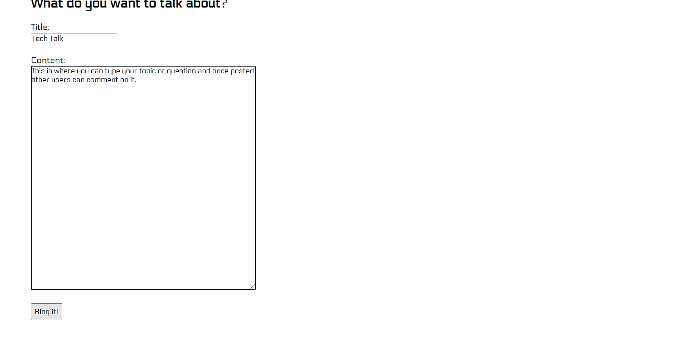
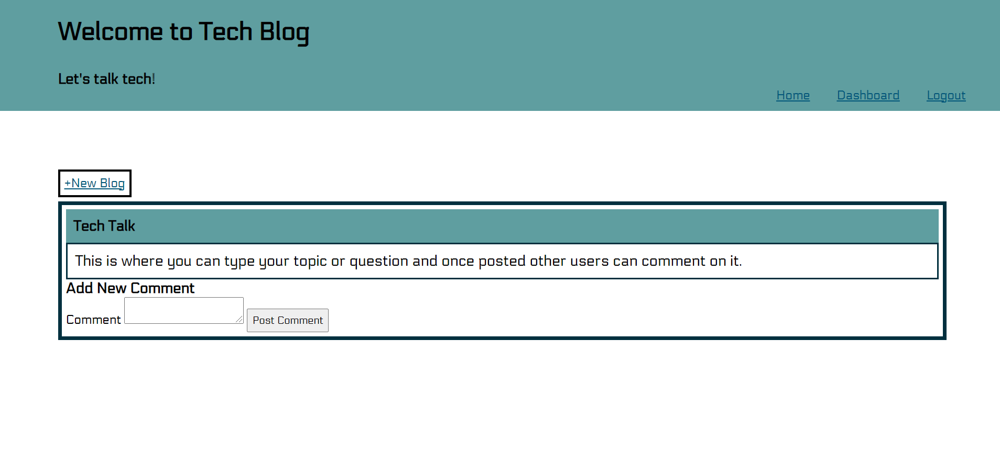

# Tech Blog
  
  

  ## Descrription
  This application is a technology blog where people can post about topics and other users can comment on the posts. Users can only post and comment after they have created an account and login.

  ## Table of Contents
  -[Description](#description)

  -[Installation](#installation)

  -[Usage](#usage)

  -[License](#license)

  -[Contributions](#contributions)

  -[Tests](#tests)

  -[Questions](#questions)

  ## Installation
  npm i

  ## Usage
  

  ## License
  Copyright (C) 2021 Zachary Eggert

  This project is licensed under the MIT license.

  https://opensource.org/licenses/MIT

  ## Contributions
  Zachary Eggert

  ## Tests
  No tests

  ## Questions
  For any questions you can reach me at:
  zreggert@gmail.com

  Also please check out this application's repo and my other work at:
  https://github.com/zreggert

## Links

## Screenshots

